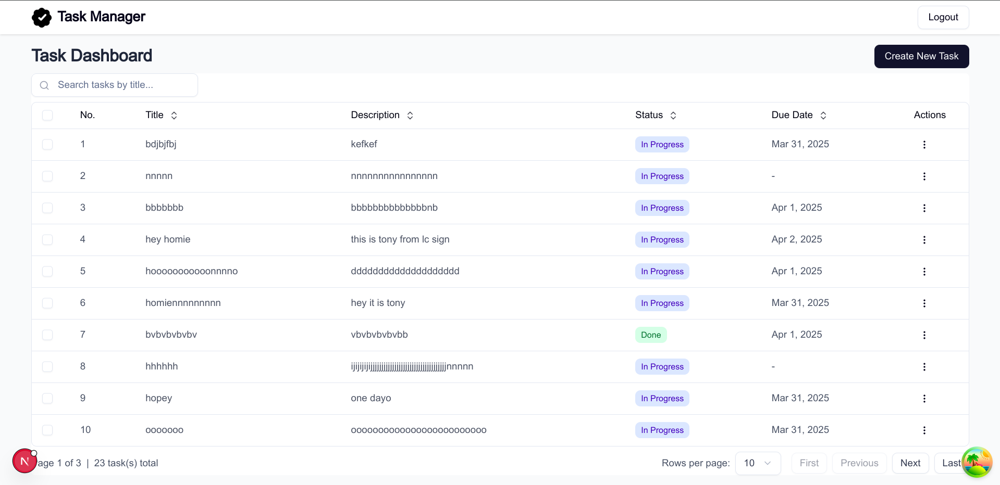

# Task Management System

 <!-- Add a screenshot if available -->

A full-featured task management application built with Next.js, Prisma, and modern web technologies. This system provides secure user authentication and complete CRUD functionality for tasks with a clean, responsive interface.

## ✨ Features

- **Secure Authentication** - JWT-based login system with protected routes
- **Task Management** - Full CRUD operations for tasks
- **Task Status Tracking** - To Do, In Progress, Done states
- **Due Date Management** - Optional due dates with calendar picker
- **Responsive UI** - Works on all device sizes
- **Form Validation** - Robust validation with Zod
- **Real-time Updates** - Optimistic UI with Zustand state management
- **Data Caching** - Efficient data fetching with TanStack Query
- **Type Safety** - Fully typed with TypeScript

## 🛠 Technology Stack

### Frontend

- **Next.js 15** (App Router)
- **React 19** with TypeScript
- **Shadcn UI** - Beautiful, accessible components
- **Tailwind CSS** - Utility-first styling
- **Zustand** - State management
- **TanStack Table** - Data table implementation
- **TanStack Query** - Data fetching and caching

### Backend

- **Next.js API Routes** & Server Actions
- **Prisma ORM** - Type-safe database client
- **Zod** - Schema validation

### Database

- **SQLite** - Lightweight, file-based database

## 🚀 Getting Started

### Prerequisites

- Node.js v18+
- npm or yarn
- SQLite (comes with Node.js)

### Installation

1. Clone the repository:

   ```bash
   git clone https://github.com/Felmeta-M/task-management-system.git
   cd task-management-system
   ```

2. Install dependencies:

   ```bash
   npm install
   ```

3. Set up environment variables:

   ```bash
   cp .env.example .env
   ```

   Edit the `.env` file with your configuration.

4. Run database migrations:

   ```bash
   npx prisma migrate dev --name init
   ```

5. Seed the database (optional):
   ```bash
   npx ts-node scripts/seed.ts
   ```

### Running the Application

Start the development server:

```bash
npm run dev
```

Open [http://localhost:3000](http://localhost:3000) in your browser.

## 📂 Project Structure

```
task-management-system/
├── prisma/                   # Database schema and migrations
|   ├── dev.db
|   └── schema.prisma
├── public/                   # Static assets
├── src/
│   ├── actions/              # Server actions
│   │   ├── auth.ts
│   │   └── task.ts
├── ├── app/                  # Next.js app router
│   │   ├── (auth)/login/
│   │   │   ├── page.tsx
│   │   └── layout.tsx
│   │   ├── (task)/tasks/
│   │   │   ├── [id]/
│   │   │   │   └── page.tsx
│   │   │   ├── edit/[id]/
│   │   │   │   └── page.tsx
│   │   │   ├── new/
│   │   │   │   └── page.tsx
│   │   │   ├── layout.tsx
│   │   │   └── page.tsx
│   │   └── global.css
│   ├── components/           # React components
│   │   ├── auth/
│   │   │   └── login-form.tsx
│   │   ├── tasks/
│   │   │   ├── fetch-tasks.tsx
│   │   │   ├── task-form.tsx
│   │   │   └── task-table.tsx
│   │   ├── ui/ (Shadcn components)
│   │   ├── delete-alert.tsx
│   │   └── navbar.tsx
│   ├── config/
│   │   └── routes.ts
│   ├── hooks/
│   │   └── use-tasks.ts
│   ├── lib/                  # Utility functions
│   │   ├── auth-utils.ts
│   │   ├── auth.ts
│   │   ├── prisma.ts
│   │   └── utils.ts
│   ├── providers/            # Providers functions
│   │   └── query-provider.tsx
│   ├── scripts/              # Scripts functions
│   │   └── seed.ts
│   ├── stores/               # Zustand stores
│   │   ├── auth-store.ts
│   │   └── task-store.ts
│   ├── types/                # TypeScript types
│   │   ├── auth.ts
│   │   └── task.ts
│   └── middleware.ts
├── .env                      # Environment variables template
├── package.json
└── README.md
```

## 🔒 Authentication

Default test credentials:

- **Username**: `admin1`
- **Password**: `password123`

## 📝 API Endpoints

| Endpoint         | Method | Description     |
| ---------------- | ------ | --------------- |
| `/api/login`     | POST   | User login      |
| `/api/tasks`     | GET    | Get all tasks   |
| `/api/tasks`     | POST   | Create new task |
| `/api/tasks/:id` | PUT    | Update task     |
| `/api/tasks/:id` | DELETE | Delete task     |

## 🧑‍💻 Development

### Scripts

- `npm run dev` - Start development server
- `npx prisma studio` - Open Prisma Studio for database management

### Database Management

To inspect the database:

```bash
npx prisma studio
```

To generate Prisma client:

```bash
npx prisma generate
```

## 🐛 Troubleshooting

**Issue**: Database connection problems  
**Solution**: Ensure the SQLite database file path in `.env` is correct

**Issue**: Authentication not working  
**Solution**: Verify JWT_SECRET in `.env` matches between server restarts

## 📄 License

This project is licensed under the MIT License - see the [LICENSE](LICENSE) file for details.

## 📧 Contact

For questions or support, please contact:  
[Your Name] - [felmetamuktar23@gmail.com]  
Project Link: [https://github.com/yourusername/task-management-system](https://github.com/yourusername/task-management-system)

---

**Happy Task Managing!** 🎉
